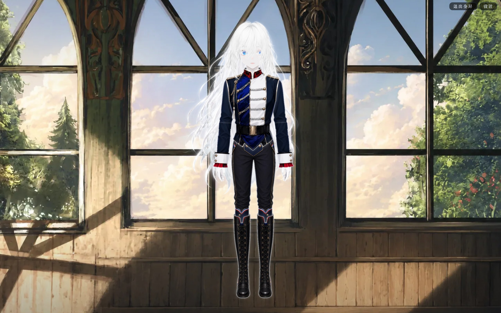
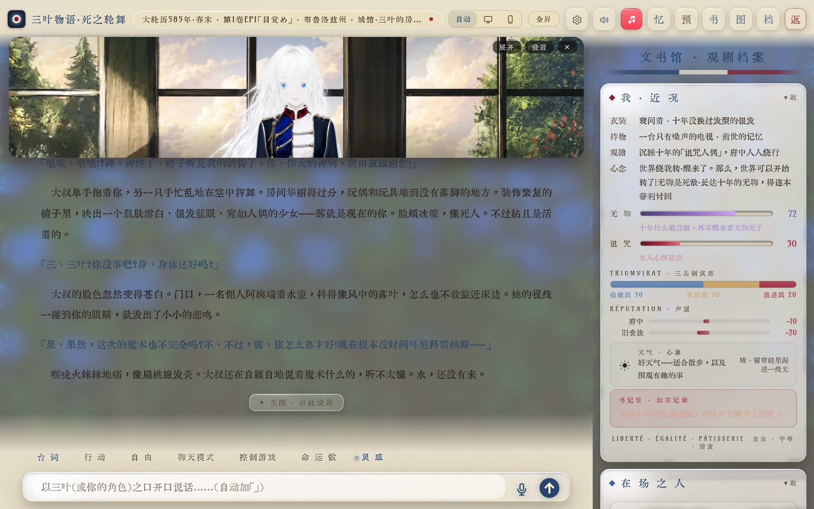
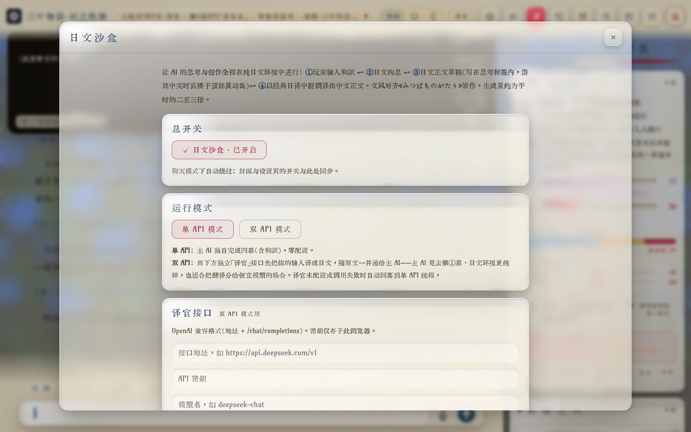
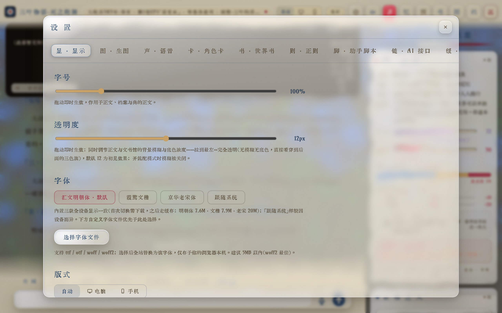

# L'Histoire de Mitsuba — The Cursed Doll and the Ronde of Death

**三叶物语 · 死之轮舞**

The Cursed Maiden and the Ronde of Death · You are Mitsuba · The world is played by AI

A pure front-end, single-page AI text role-playing game

[中文](../README.md) · **English**

---

## ✦ Highlight 1: Live2D Character Sprite

**Mitsuba Klauber** — a silver-haired, blue-eyed girl who looks like a living doll — appears as a finely-drawn Live2D sprite. The sprite lives in the **dynamic island** above the story text, switching with the scene and characters; one tap on "Expand" fills the whole screen, with light, window scenery and the detail of her uniform rendered crisply. The sprite breathes with the story, turning a text adventure into a performance with real presence.

*The sprite island floats above the story · the live "Archive · Chronicle" status panel on the right*

## ✦ Highlight 2: Japanese Sandbox

Let the AI **think and write entirely in a pure Japanese environment**, then render the Chinese prose in the tone of a classic Japanese-to-Chinese translation — matching the writing style of the original novel *Mitsuba Monogatari* seamlessly:

**①** Translate the player's input into Japanese → **②** Compose in Japanese → **③** Draft the Japanese prose (live-streamed on the top island's "Japanese" tab while playing) → **④** Render the Chinese prose in a translator's tone

- **Single-API / Dual-API modes**: Single-API lets the main model complete all four acts with zero setup; Dual-API uses a separate "translator" endpoint to first render the input into Japanese, for a purer Japanese environment — and lets you offload translation to a cheaper model.
- **Per-act toggles**: input translation / Japanese composition / Japanese draft / translator's tone — each of the four acts can be switched on or off independently.
- While the AI is generating, the top island automatically switches to the "Japanese" tab and live-streams the full thinking and Japanese draft.

---

## Other Features

*Font size / transparency / typeface / layout / image generation / voice / character cards / lorebook / regex / helper scripts / multiple endpoints — all adjustable*

- **Liquid-glass interface**: floating glass and gradient fades inspired by Apple's design aesthetic, an opening with a tricolor flag rippling in the wind, dark/light themes, and a one-tap low-power mode.
- **Archive · Chronicle**: the Boredom and Curse curves breathe with the plot, a triumvirate seat bar, a bipolar reputation bar, the present characters' disposition, and the scribe's faithful record — read the whole situation at a glance.
- **Faithful narrative engine**: the plot follows the original timeline; characters' personalities, speech, forms of address and translated names strictly match the built-in lorebook; they know only what has happened up to the current point in time.
- **SillyTavern ecosystem compatible**: import SillyTavern character cards (PNG / JSON) directly, advanced lorebook fields, regex scripts, a sandboxed helper-script runtime, chain-of-thought folding, and prompt inspection.
- **Fluid controls**: streaming output, chat mode, suggested next moves, a fate die, voice input and read-aloud, per-scene edit/delete, re-roll with kept drafts, export-to-book, and shareable opening codes.
- **Illustrate this scene**: connect your own image-generation endpoint to create art for each scene (NovelAI / ComfyUI / OpenAI-compatible / SD, etc.).

## How to Play

The game **does not bundle any AI** — you connect your own AI endpoint to drive the world:

1. Open the online address (or open it in a browser locally).
2. Click "Connect AI" and fill in your own AI endpoint URL and key.
3. Click "Ouverture", pick an opening, and begin.

Saves, memory, keys and all data live only in your browser — nothing is uploaded, there is no server and no database.

## Original Work

This is a **non-commercial derivative fan work** based on the light novel *Mitsuba Monogatari* (by Matari Nanasawa), made purely for fan exchange. All rights to the original work and its characters, settings and story belong to the original author and publisher.

---

## Terms of Use & Disclaimer

- This project provides **only a pure front-end web program**. It does not include, proxy or provide any AI model or generation service. The AI endpoint required to run the game is **configured by the user and connects directly to the provider of their own choosing**.
- The game is a purely static web page with **no server-side program and no database**. Your saves, chat logs, memory, keys and all other data live only in your local browser; neither this project nor the author can collect or receive any of it.
- **All AI behavior, and all of the user's input and output content, are produced independently by the user, who bears full responsibility for them — none of it has any connection to this project or its author.** Users must comply with the laws of their jurisdiction and the terms of the AI provider they use.
- **Prohibited**: scraping, crawling or reverse-extracting this project's code, assets or data; any commercial use of this project or any part of it; and creating derivative works, rewrites, re-skins or redistributions based on the same architecture as this project.
- This project is provided "AS IS", without warranty of any kind, express or implied. The author bears no liability for any direct or indirect consequences arising from its use.

Contact: ekibenya@outlook.com
